# arduino-assignment-group9
The description of the Arduino project of group 9 for the Open Science course.

The goal of this project is to create a CO2, Temperature, Pressure and Relative Humidity sensor using an Arduino UNO R3. To do so you will need to correctly connect the components to the Arduino using the Breadboard, and you will need to use the Arduino IDE on your laptop to upload code to the Arduino to tell it what to do. Below you will find a list of information and instructions on how to do this, good luck.

## Initial setup
Before getting started on building the sensor you will need to do two things. To start, you will have to install the Arduino IDE on your computer, this is necessary to upload code to the Arduino. Then you need to make sure that your copy of the Arduino UNO R3 is working, to do so you will need the IDE.

### Installing the Arduino IDE
Note that on depending on the operating system the installation process may differ.

Step 1. To download this IDE you can google "Arduino IDE" and then navigate to the Arduino docs website; alternatively you can click [here](https://docs.arduino.cc/software/ide/). 

Step 2. Press the blue download button, on the next page choose your operating system in the dropdown menu and press download.

Step 3. Navigate to your download folder and double-click the `arduino-ide.exe`. Press the "continue", "next" and "install" buttons a few times. Once it starts it will take a few minutes. For Mac: run the .dmg file, and drag the IDE icon into applications as indicated in the popup menu.

Step 4. Once done installing, choose the "run Arduino IDE" option and press "Finish".

Step 5a. You will now be asked to give some permissions, accept them to start using the IDE.

Step 5b. It might also ask you to update to the newest version. If this is the case, follow the instructions

Step 6. Restart the program.

Congratulations, you are now ready to give your Arduino some instructions.

### Testing your Arduino
Step 1. To test the functionality of your Arduino, connect the Arduino using the USB-C (computer) to USB-B cable (Arduino).

Step 2. Open the Arduino IDE.

Step 3. Select "file" in the top left-hand corner. Choose "Examples", "01.Basics", and then "Blink". This will open a new window with the Blink code. 

Step 4. In the top "Select Board" drop-down menu choose the Arduino UNO R3.

Step 5. To upload and run the "Blink" code, press the "Upload" button with a blue arrow near the top left-hand corner. The built-in orange LED (labeled "L") on the Arduino should now start blinking once every second.

(Step 6.) If your LED does not start blinking make sure you have selected the right model in the upper drop-down menu. In case this is correct, but the LED still doesn't start blinking, try using a different Arduino device. If the second device does work it means that the first one you used is fried.

## Building the sensor
Now that the initial setup has been completed you can begin building the sensor.

### Components
Below is a list of all components, with images of the front and back.

The Arduino UNO R3:

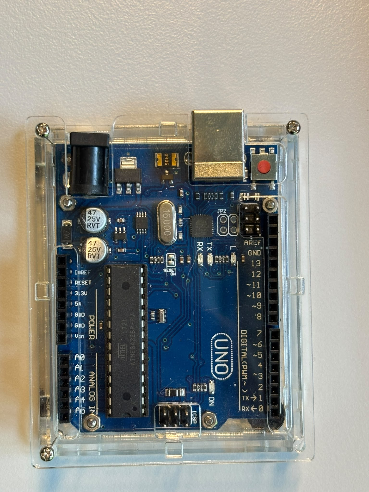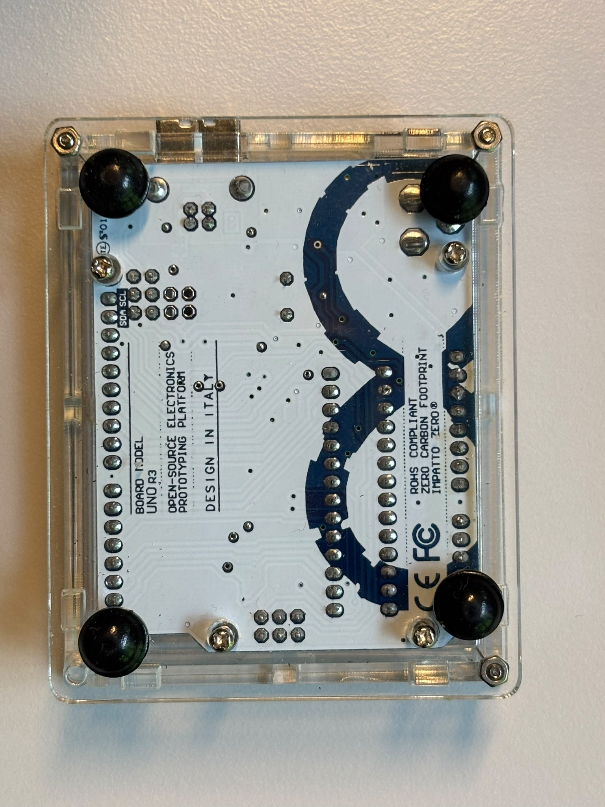
Datasheet: datasheet/A000066-datasheet.pdf
Pinout: datasheet/A000066-full-pinout.pdf

The breadboard:

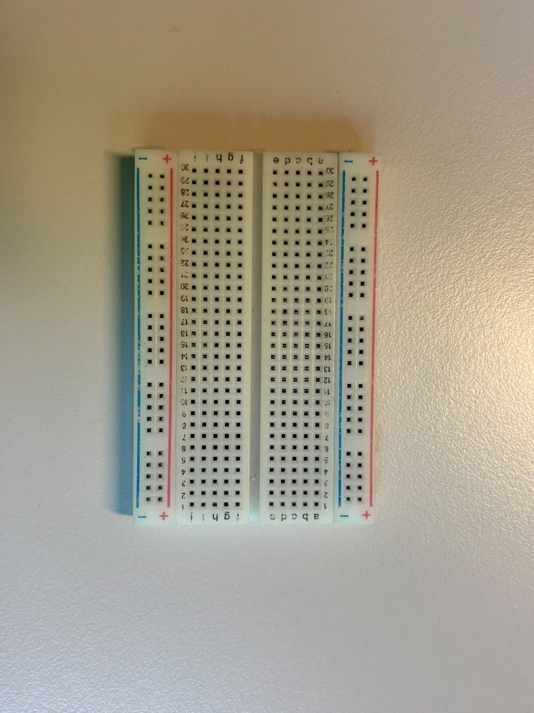

Cables in various lengths and colours:

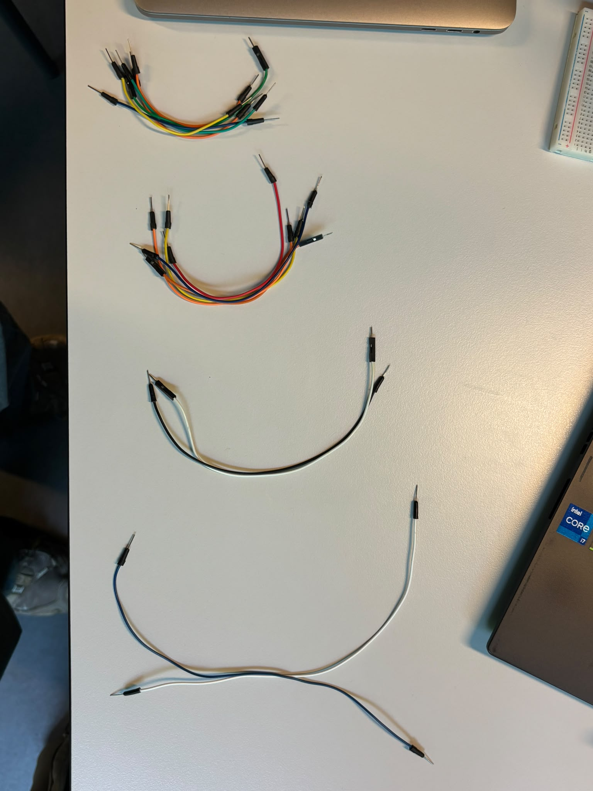

Cable to connect the Arduino to either a power source or a computer:

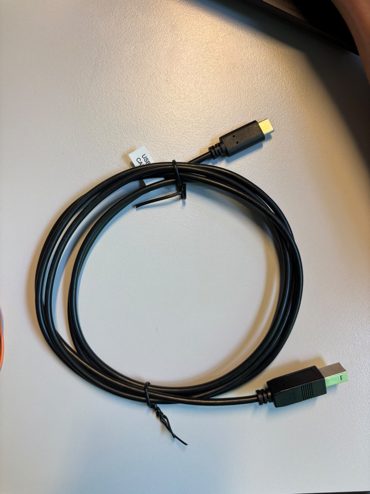

There are two sensors involved in this setup. 
The first is the CO2 sensor:

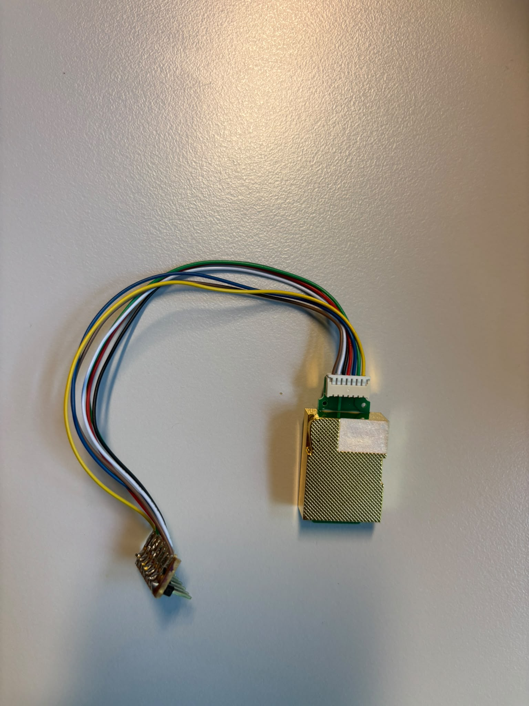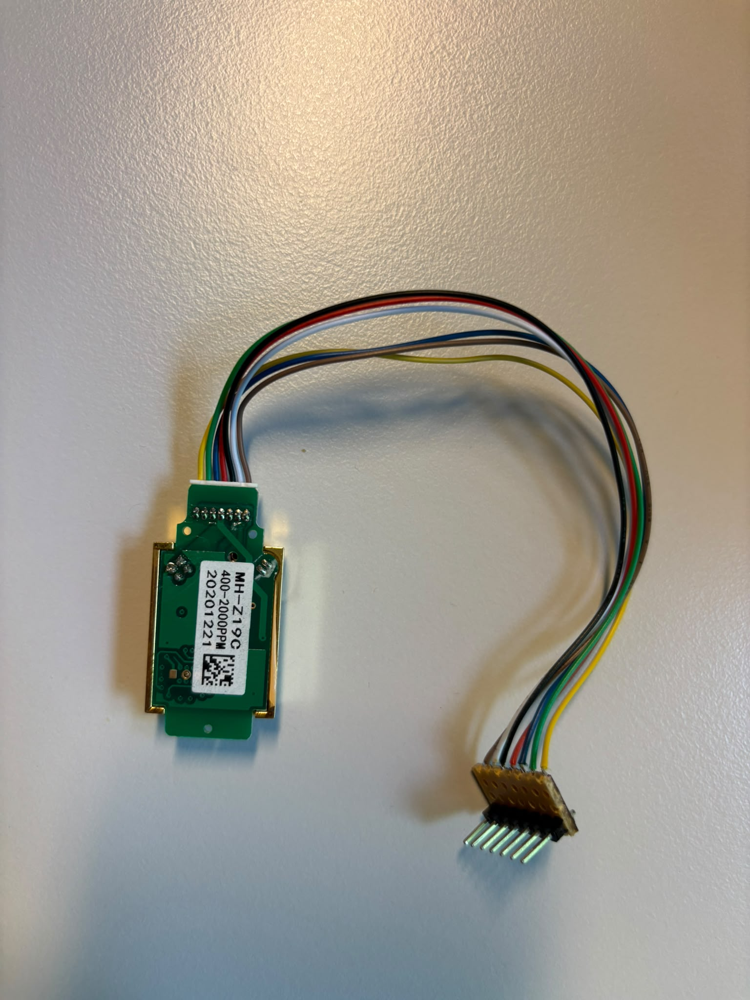
Datasheet: datasheet/mh-z19c-pins-type-co2-manual-ver1_0.pdf

The other sensor is the Pressure/Temperature/Relative Humidity sensor:

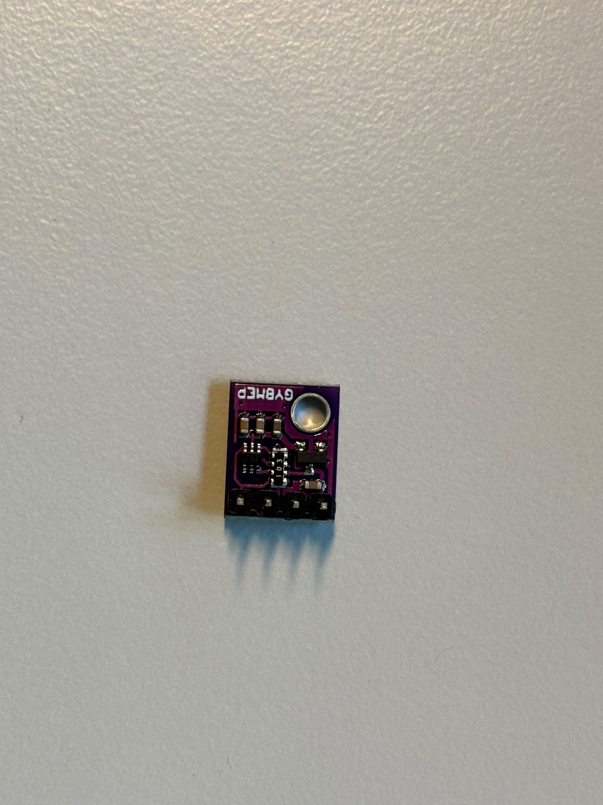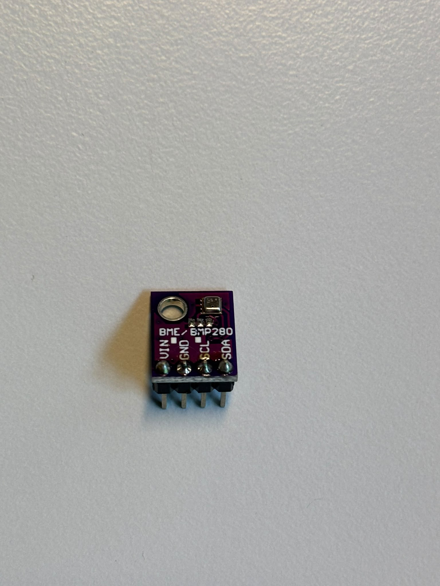
Datasheet: datasheet/BST-BME280-DS002-1509607.pdf

Finally, the SD card reader with the SD card where the measured data is written to:

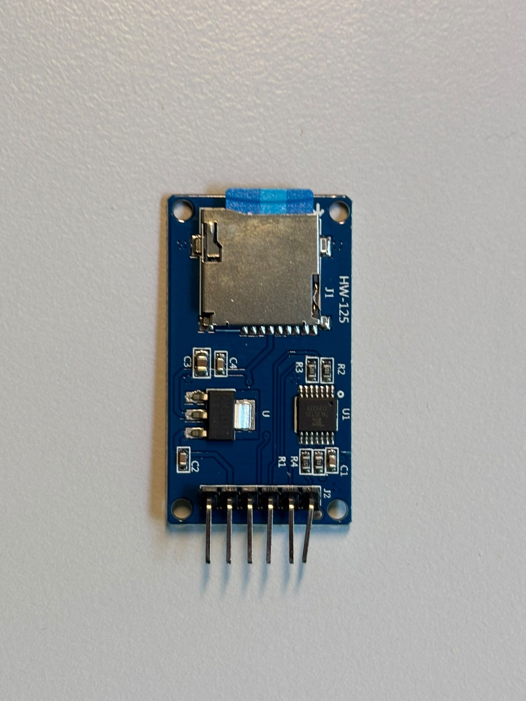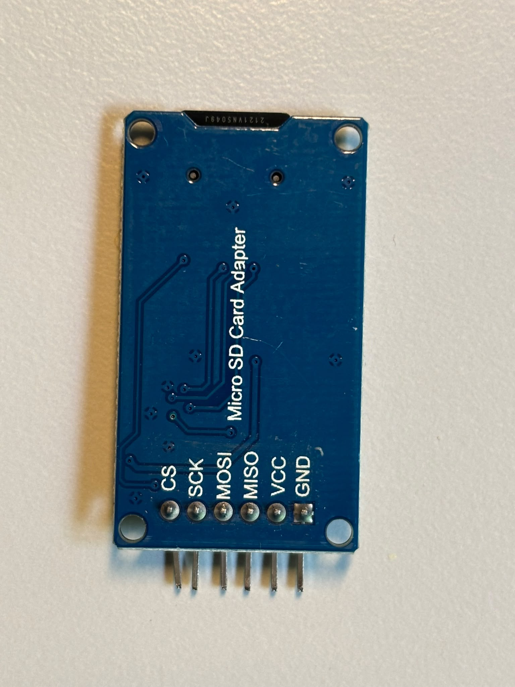

### Wiring diagram
To wire the Arduino we will be using a breadboard, which is a tool that's often used when prototyping. The breadboard consists of two different types of areas, referred to as strips. The strips are electronically connected, but along different axes. The rows at the top and the bottom of the image, labeled + and -, are interconnected along the row, whereas in the center the different columns are interconnected, although the different halves of the breadboard are disconnected. Making sure the Arduino isn't plugged in to the PC/laptop, connect all components using wires and the breadboard according to the following image:

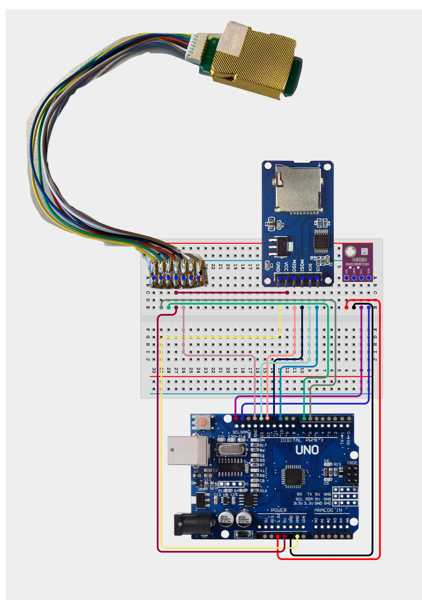

Or consult the following table (CO2 sensor pins going from left to right): 
| CO2 Sensor pin 2  | Arduino pin 6  |
| CO2 Sensor pin 3  | Arduino pin 7  |
| CO2 Sensor pin 4  | Arduino 5V     |
| CO2 Sensor pin 4  | SD Module VCC  |
| CO2 Sensor pin 5  | Arduino GND    |
| SD Module GND     | Arduino GND    |
| SD Module MISO    | Arduino pin 12 |
| SD Module MOSI    | Arduino pin 11 |
| SD Module SCK     | Arduino pin 13 |
| SD Module CS      | Arduino pin 10 |
| PTRH VIN          | Arduino 3.3V   |
| PTRH GND          | Arduino GND    |
| PTRH SCL          | Arduino SCL    |
| PTRH SDA          | Arduino SDA    |

Coloured lines indicate wires (NB the colours are arbitrary and are only there for clarity). The blue dots on the components indicate the pins and show where they should be inserted into the breadboard.

### Download the repository
On the GitHub repository homepage, click the green `<> Code` button near the top and click `Download ZIP` at the bottom of the dropdown menu, or alternatively, click [here](https://github.com/JobEnning/arduino-assignment-group9/archive/refs/heads/main.zip). Unzip at the desired location. All file locations in the following are relative to this directory. 

## Running the codes
### General
Connect the Arduino using the USB-C (computer) to USB-B cable (Arduino). At the top, select the Arduino UNO. 
At the left, click the Library Manager button (books icon). Search for `Adafruit BME280 Library`, and install version 2.3.0 and its dependencies (press the "install all" button). 

### Temperature, pressure and relative humidity
Open the file `code/PTRHsensor/PTRHsensor.ino` in the Arduino IDE, by choosing `File`->`Open...` and navigating to the files that were just downloaded. Make sure the SD card is plugged in, and upload the code to the Arduino by clicking the `Upload` button in the top left (arrow to the right). Open the `Serial Monitor` with the button at the top right. The code will initialize the SD card and then starts measuring. The data is shown in the Serial Monitor window, but is also written to a `data.csv` file on the SD card; see below. The sensor measures the temperature (in degrees Celsius), the pressure (in Pascal) and the relative humidity (in percentages) with an interval of 10 seconds. 

### CO2 sensor
For the CO2 sensor, the same steps should be followed as for the temperature/pressure/relative humidity sensor, but with the file `code/CO2sensor/CO2sensor.ino`. The sensor measures the CO2 concentration of the air in parts per million (ppm) every 10 seconds. 

## Extract the data
The file `code/csv-extract/csv-extract.ino` can be used to show all the data stored in the `data.csv` file on the Arduino. Open the file and upload it to the Arduino as before. By running the code, the data is printed to the Serial Monitor window. Create a file with suffix `.dat` in some text editor (for example VSCode), and save it to the folder `code/analyse`  (Example data in `code/analyse/testdata_bme.dat` for the temperature/pressure/relative humidity data, `code/analyse/testdata_CO2.dat` for the CO2 concentration data) for analysis; see below. The file possibly contains data from both sensors; make sure to put the data corresponding to the correct sensor in the correct file. 

## Clear the SD card
The file `code/sdcard-erase/sdcard-erase.ino` can be used to erase the data on the SD card. Open the file and upload to the Arduino as before. 

## Analysis
The code `analyse/plot.py` generates plots showing the data. Run this Python code using VSCode, Spyder or any other software capable of running Python code. 
